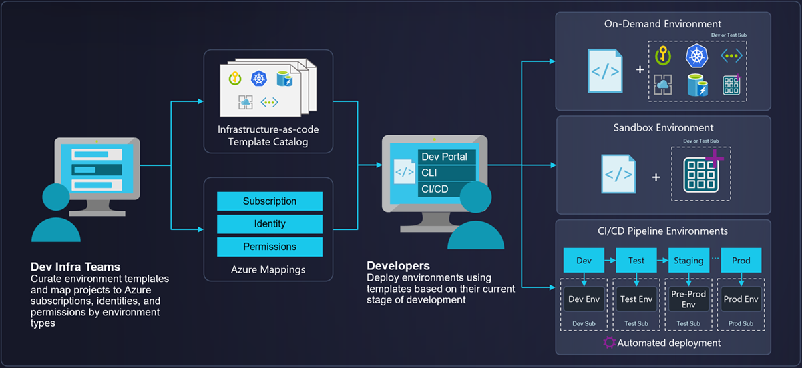

# Azure Deployment Environments

Azure Deployment Environments empowers development teams to quickly and easily spin up app infrastructure with project-based templates that establish consistency and best practices while maximizing security. This on-demand access to secure environments accelerates the stages of the software development lifecycle in a compliant and cost-efficient way.



## Overview

A deployment environment is a preconfigured collection of Azure resources deployed in predefined subscriptions. Azure governance is applied to those subscriptions based on the type of environment, such as sandbox, testing, staging, or production.

With Azure Deployment Environments, your platform engineer can enforce enterprise security policies and provide a curated set of predefined infrastructure as code (IaC) templates.

> Note: Azure Deployment Environments currently supports only Azure Resource Manager (ARM) templates and Terraform (Private Preview)

Learn more about the [key concepts for Azure Deployment Environments](https://learn.microsoft.com/en-us/azure/deployment-environments/overview-what-is-azure-deployment-environments).

This repo uses the Azure Developer CLI to bootstrap a DevCenter resource with the minimun configuration required to start using Azure Deployment Environments. That includes:

- A resource group
- An Azure DevCenter resource
- An Azure Key Vault resource to store the GitHub token to connect to the catalog
- Sample DevCenter environment types (development, sandbox)
- Sample DevCenter projects (Team-one, Team-two)
- Projects environment types definitions (development, sandbox)

## Pre-requisites

1. [Azure CLI](https://docs.microsoft.com/en-us/cli/azure/install-azure-cli)
2. [Azure Developer CLI](https://learn.microsoft.com/en-us/azure/developer/azure-developer-cli/)
3. [Terraform CLI](https://learn.hashicorp.com/tutorials/terraform/install-cli)
4. An Azure subscription with at least `Owner` RBAC role assigned to the deployment identity

## Deploy with Azure Developer CLI

1. Define the following environment variables which will be used to link a GitHub repository as a DevCenter catalog. The catalog is the repository that contains the environment definitions as infrastructure as code templates. Use the [Azure official repo for Azure Deployment Environments](https://github.com/Azure/deployment-environments) to import sample environments.

```bash
# Bash
export GITHUB_TOKEN=<your_github_token>
export GIT_OWNER=<git_owner> # Use 'Azure' to use Microsoft official catalog
export GIT_REPO=<git_repo> # Use 'deployment-environments' to use Microsoft official catalog
```

PowerShell:
```PowerShell
# PowerShell
$env:GITHUB_TOKEN="<your_github_token>"
$env:GIT_OWNER="<git_owner>" # Use 'Azure' to use Microsoft official catalog
$env:GIT_REPO="<git_repo>" # Use 'deployment-environments' to use Microsoft official catalog
```

2. Run `azd up` from the root folder of this repository and follow the prompts to bootstrap your DevCenter.
3. Go to the [Developer Portal](https://devportal.microsoft.com) and start creating environments.

## Resources

- [Azure Deployment Environments Docs](https://learn.microsoft.com/en-us/azure/deployment-environments/overview-what-is-azure-deployment-environments)
- [Azure Deployment Environments GitHub repo](link_to_sample_templates_repository)

## Contributing

This project welcomes contributions and suggestions. Submit a pull request with your changes!

## Issues & Feedback

If you have any feature requests, issues, or areas for improvement, please file an issue.