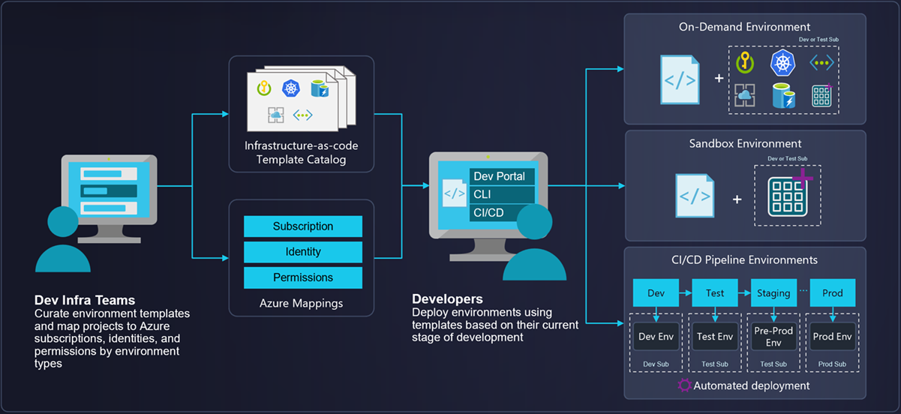
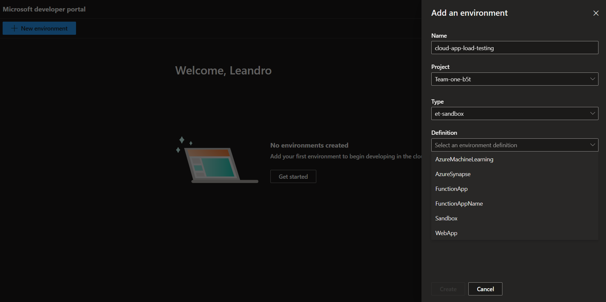

# Terraform template to bootstrap Azure Deployment Environments

Azure Deployment Environments empowers development teams to quickly and easily spin up app infrastructure with project-based templates that establish consistency and best practices while maximizing security. This on-demand access to secure environments accelerates the stages of the software development lifecycle in a compliant and cost-efficient way.

This repo uses the Azure Developer CLI to bootstrap a DevCenter resource with the minimun configuration required to start using Azure Deployment Environments.



Learn more about the [key concepts for Azure Deployment Environments](https://learn.microsoft.com/en-us/azure/deployment-environments/overview-what-is-azure-deployment-environments).

## Overview

A deployment environment is a preconfigured collection of Azure resources deployed in predefined subscriptions. Azure governance is applied to those subscriptions based on the type of environment, such as sandbox, testing, staging, or production.

With Azure Deployment Environments, your platform engineers can enforce enterprise security policies and provide a curated set of predefined infrastructure as code (IaC) templates. Your developers will use those templates to deploy environments on demand in a self-service manner.

> Note: Azure Deployment Environments currently supports only Azure Resource Manager (ARM) templates and Terraform (Private Preview).

This repo will deploy several Azure resources and configure DevCenter to let you start exploring Azure Deployment Environments. The following resources will be deployed:

- A resource group
- An Azure DevCenter resource
- An Azure Key Vault resource to store the GitHub token to connect to the catalog
- Sample DevCenter environment types (development, sandbox, etc.)
- Sample DevCenter projects (Team-one, Team-two, etc.)
- Projects environment types definitions (development, sandbox)

The projects and environments defined serve as inspiration to start using Azure Deployment Environments, you can delete them and create your own.

All Azure resources are defined as code using Terraform (in the `infra` folder) or Bicep (in the `infra-bicep` folder). You can choose which IaC tool to use for deployment.

Let's get started!

## Pre-requisites

Make sure you have the following tools installed:

1. [Azure CLI](https://docs.microsoft.com/en-us/cli/azure/install-azure-cli)
2. [Azure Developer CLI](https://learn.microsoft.com/en-us/azure/developer/azure-developer-cli/)
3. [Terraform CLI](https://learn.hashicorp.com/tutorials/terraform/install-cli) (if using Terraform deployment)
4. [Azure Bicep CLI](https://learn.microsoft.com/en-us/azure/azure-resource-manager/bicep/install) (if using Bicep deployment)
5. An Azure subscription with at least `Owner` RBAC role assigned to the deployment identity

## Deploy with Azure Developer CLI

> Note: Before starting, create a GitHub PAT with `repo` scope to connect to a GitHub repository as a catalog. Learn more about [creating a GitHub PAT](https://docs.github.com/en/github/authenticating-to-github/keeping-your-account-and-data-secure/creating-a-personal-access-token).

1. Define the following environment variables which will be used to link a GitHub repository as a DevCenter catalog. A catalog is the repository that contains the environment definitions as infrastructure as code templates. Use the [Azure official repo for Azure Deployment Environments](https://github.com/Azure/deployment-environments) to import sample environments.

```bash
# Bash
export GITHUB_TOKEN=<github_token>
export GITHUB_OWNER=<github_owner> # Use 'Azure' to use Microsoft official catalog
export GITHUB_REPO=<github_repo> # Use 'deployment-environments' to use Microsoft official catalog
```

PowerShell:
```PowerShell
# PowerShell
$env:GITHUB_TOKEN="<github_token>"
$env:GITHUB_OWNER="<github_owner>" # Use 'Azure' to use Microsoft official catalog
$env:GITHUB_REPO="<github_repo>" # Use 'deployment-environments' to use Microsoft official catalog
```

2. Run `azd up` from the root folder of this repository and follow the prompts to bootstrap your DevCenter.
   
   By default, the Terraform provider will be used. To use Bicep instead, modify the `azure.yaml` file and change the provider from `terraform` to `bicep`:
   
   ```yaml
   infra:
     provider: bicep
     path: infra-bicep
   ```

3. Go to the [Developer Portal](https://devportal.microsoft.com) and start creating environments.
3. Go to the [Developer Portal](https://devportal.microsoft.com) and start creating environments.

## Deploy with Bicep Directly

If you prefer to deploy using Bicep directly instead of the Azure Developer CLI, follow these steps:

1. Set the GitHub token and other parameters in the `infra-bicep/main.parameters.json` file.

2. Create a resource group for deployment:
```bash
az group create --name myDevCenterRG --location eastus
```

3. Deploy the Bicep template:
```bash
az deployment group create \
  --resource-group myDevCenterRG \
  --template-file infra-bicep/main.bicep \
  --parameters infra-bicep/main.parameters.json \
  --parameters githubToken=<your_github_token>
```

4. Go to the [Developer Portal](https://devportal.microsoft.com) and start creating environments.

## Switching Between Terraform and Bicep Deployment

This repository supports both Terraform and Bicep for deploying the Azure DevCenter resources. You can easily switch between the two:

### To use Terraform (default)
```bash
# Ensure you are using the default azure.yaml
cp azure.yaml azure.yaml.bicep.bak # backup bicep version if needed
```

### To use Bicep
```bash
# Switch to the Bicep version of azure.yaml
cp azure.yaml.bicep azure.yaml
```

## Developer Experience

Once Azure Deployment Environments is deployed and configured, you can start creating environments in the Developer Portal. The following screenshot shows the Developer Portal with the sample environments and projects deployed with this repo.



Alternatively, you can deploy environments using the Azure CLI. Learn more about the [Azure Deployment Environments CLI](https://learn.microsoft.com/en-us/azure/deployment-environments/how-to-create-access-environments) or [CI/CD pipelines](https://learn.microsoft.com/en-us/azure/deployment-environments/tutorial-deploy-environments-in-cicd-github).

## Resources

- [Azure Deployment Environments Docs](https://learn.microsoft.com/en-us/azure/deployment-environments/overview-what-is-azure-deployment-environments)
- [Azure Deployment Environments GitHub repo](link_to_sample_templates_repository)
- [Microsoft Build 2023 session: Self-serve app infrastructure using Azure Deployment Environments](https://build.microsoft.com/en-US/sessions/e102bb71-f8ef-4538-9a59-158ec6f442b6?source=sessions)

## Contributing

This project welcomes contributions and suggestions. Submit a pull request with your changes!

## Issues & Feedback

If you have any feature requests, issues, or areas for improvement, please file an issue.